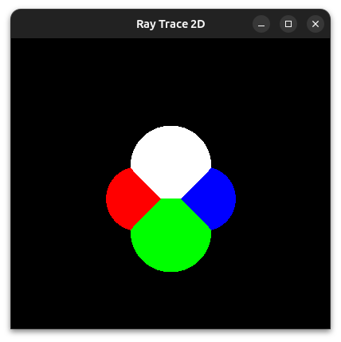
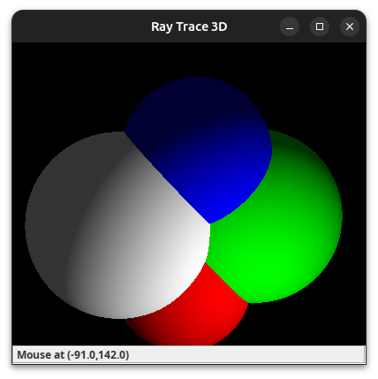

# Graphics Lab

Re-animating all my homework from my from [Fall 2000 NYU Graduate Computer Graphics](https://cs.nyu.edu/~perlin/courses/fall2000/) class as fun learning project. I wanted to re-learn all the math involved since it's been so long. All the homework was written as Java Applets to simplify sharing and grading. As they are now obselete I converted the main Class to Swing. I've also started to reproduce them in JavaScript.

## Usage
To run them install a Java compiler and compile/run the main file e.g. 

```bash
cd raytrace2d
javac RayTraceFrame.java
java RayTraceFrame
```


